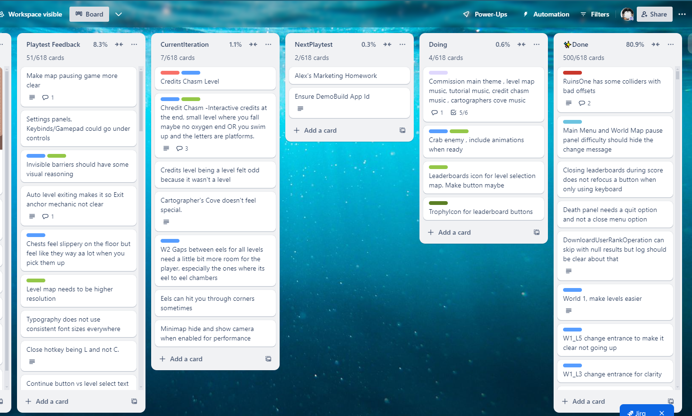

# Prello

A chrome plugin that adds a percentage indicator and card counter to list's on trello.

## Known Issues

- The extension doesn't update the numbers when you add a new card at the moment

## Installation Instructions

At the moment, you need to install this from sources:

1. `git clone `
2. Follow the [Load Unpacked Extension](https://knowledge.workspace.google.com/kb/load-unpacked-extensions-000005962) page and point it to the repository.